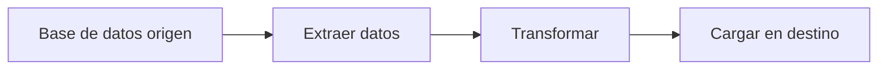

# Clase 01: Entorno de Desarrollo e Inteligencia Artificial

## Objetivos de aprendizaje

- Comprender qué es un IDE (*Integrated Development Environment*) y por qué es esencial
- Conocer VS Code y sus ventajas para ingeniería de datos
- Identificar las extensiones más útiles de VS Code para trabajar con datos
- Entender qué es Google Colab y cuándo usarlo
- Comprender el rol de los asistentes de código con IA en el desarrollo moderno
- Conocer qué es Spec Driven Development (SDD) y cómo potencia la generación de código
- Entender qué es Test Driven Development (TDD) y por qué importa

---

## ¿Qué es un IDE?

Un **IDE** (*Integrated Development Environment*, o Entorno de Desarrollo Integrado) es una aplicación que reúne todas las herramientas que necesitas para escribir, ejecutar y depurar código en un solo lugar.

### Analogía

Imagina que quieres construir un mueble. Podrías usar un martillo aquí, un destornillador allá, buscar los clavos en otro cajón... o podrías tener un **taller completo** con todas tus herramientas organizadas en una misma mesa de trabajo. Un IDE es ese taller: en lugar de abrir programas separados para escribir código, ejecutarlo, buscar errores y gestionar archivos, todo está integrado en una sola ventana.

Un editor de texto simple (como el Bloc de Notas) sería como tener solo un martillo: funciona, pero te falta todo lo demás.

Las características principales de un IDE incluyen:

- **Editor de código** con resaltado de sintaxis (*syntax highlighting*) y autocompletado
- **Terminal integrada** para ejecutar comandos sin salir de la aplicación
- **Explorador de archivos** para navegar tu proyecto
- **Depurador** (*debugger*) para encontrar errores paso a paso
- **Integración con Git** para gestionar versiones de tu código

---

## VS Code: el editor preferido de la industria

**Visual Studio Code** (VS Code) es un IDE desarrollado por Microsoft que se ha convertido en el editor más usado del mundo. No es casualidad: combina simplicidad con una potencia enorme gracias a su sistema de extensiones.

### ¿Por qué VS Code?

- **Gratuito y de código abierto**: no necesitas pagar licencias
- **Extensible**: miles de extensiones que agregan funcionalidades específicas
- **Terminal integrada**: ejecuta comandos directamente sin cambiar de ventana
- **Git integrado**: gestiona tus repositorios sin salir del editor
- **Multiplataforma**: funciona en Windows, macOS y Linux
- **Gran comunidad**: abundante documentación, tutoriales y soporte

> VS Code no es lo mismo que Visual Studio. Visual Studio es un IDE más pesado orientado a desarrollo empresarial con .NET. VS Code es ligero, rápido y más flexible.

---

## Extensiones útiles para ingeniería de datos

Las **extensiones** (*extensions*) son complementos que agregan funcionalidades a VS Code. Piensa en ellas como las aplicaciones de tu teléfono: el teléfono funciona sin ellas, pero con las apps correctas se vuelve mucho más útil.

Para instalar una extensión, abre la barra de extensiones con `Ctrl+Shift+X` y busca por nombre.

### Python & Pylance

La extensión **Python** (de Microsoft) junto con **Pylance** transforma VS Code en un entorno completo para programar en Python:

- Resaltado de sintaxis y autocompletado inteligente
- Detección de errores mientras escribes (sin necesidad de ejecutar)
- Navegación rápida entre funciones y archivos

### SQLTools

**SQLTools** te permite conectarte a bases de datos (PostgreSQL, MySQL, SQLite, entre otras) directamente desde VS Code:

- Ejecutar consultas SQL sin salir del editor
- Ver resultados en tablas dentro de VS Code
- Gestionar múltiples conexiones a bases de datos

### Docker

La extensión **Docker** facilita el trabajo con contenedores, una tecnología fundamental en ingeniería de datos:

- Visualizar y gestionar contenedores e imágenes
- Editar archivos `Dockerfile` y `docker-compose.yml` con autocompletado
- Ejecutar y detener contenedores con un clic

### Data Wrangler

**Data Wrangler** (de Microsoft) es una herramienta visual para explorar y transformar datos:

- Visualizar DataFrames de pandas en una interfaz gráfica
- Filtrar, ordenar y transformar columnas sin escribir código
- Generar automáticamente el código Python de las transformaciones que realizas

### Jupyter Notebook

La extensión **Jupyter** permite trabajar con notebooks directamente dentro de VS Code:

- Crear y ejecutar notebooks (`.ipynb`) sin abrir Jupyter Lab en el navegador
- Combinar celdas de código con texto explicativo
- Visualizar gráficos y tablas inline

### Resumen de extensiones

| Extensión | ¿Para qué sirve? |
|-----------|-------------------|
| Python & Pylance | Programar en Python con autocompletado y detección de errores |
| SQLTools | Conectarse a bases de datos y ejecutar consultas SQL |
| Docker | Gestionar contenedores e imágenes Docker |
| Data Wrangler | Explorar y transformar datos visualmente |
| Jupyter Notebook | Trabajar con notebooks dentro de VS Code |

---

## Google Colab

### ¿Qué es Google Colab?

**Google Colab** (o Colaboratory) es un entorno de notebooks en la nube proporcionado por Google. Funciona directamente en tu navegador, sin necesidad de instalar nada en tu computador.

Con Google Colab puedes:

- Escribir y ejecutar código Python en celdas interactivas
- Usar librerías populares (pandas, numpy, matplotlib) que ya vienen preinstaladas
- Acceder a GPUs y TPUs gratuitas para tareas que requieren más poder de cómputo
- Compartir notebooks con tu equipo como si fueran documentos de Google Docs

### ¿Cuándo usar Google Colab vs VS Code?

| Característica | Google Colab | VS Code |
|---------------|-------------|---------|
| Instalación | No requiere (funciona en el navegador) | Requiere instalación local |
| Configuración del ambiente | Preconfigurado | Tú configuras tu ambiente |
| Colaboración en tiempo real | Sí, como Google Docs | No nativo (requiere extensiones) |
| Acceso a GPU/TPU | Sí, gratuito con límites | Solo si tu computador tiene GPU |
| Proyectos grandes | Limitado (sesiones temporales) | Ideal (todo es local y persistente) |
| Trabajo offline | No | Sí |

> **Recomendación**: Usa Google Colab para **explorar datos** y hacer prototipos rápidos. Usa VS Code cuando trabajes en **proyectos formales** que necesitan estructura, control de versiones y despliegue.

---

## Asistentes de código con IA: el presente y futuro

El presente y futuro de las herramientas de ingeniería de datos está siendo transformado por los **asistentes de código con inteligencia artificial**. Estas herramientas analizan el contexto de tu código y te sugieren líneas, funciones completas e incluso soluciones a problemas.

### Analogía

Imagina que estás aprendiendo a cocinar. Un asistente de IA es como tener un **chef experimentado** a tu lado: no cocina por ti, pero cuando estás picando verduras, te dice "la próxima vez prueba cortarlo en juliana, queda mejor para esta receta". Tú decides si seguir su consejo o no. Cuanto más aprendes, mejores preguntas le haces y mejores sugerencias recibes.

### ¿Por qué esto cambia las reglas del juego?

- **Velocidad**: tareas repetitivas que antes tomaban minutos ahora toman segundos
- **Aprendizaje**: el asistente te muestra patrones y buenas prácticas mientras trabajas
- **Reducción de errores**: detecta problemas comunes antes de que los ejecutes
- **Accesibilidad**: permite que personas con menos experiencia sean productivas más rápido

> **Importante**: Los asistentes de IA son herramientas que **potencian** tu trabajo, no lo reemplazan. Entender qué hace tu código sigue siendo fundamental.

---

## Herramientas de IA para VS Code

Existen varias herramientas de asistentes de IA que se integran directamente en VS Code. Estas son algunas de las más relevantes:

### GitHub Copilot

Desarrollado por GitHub (Microsoft) y OpenAI. Es el asistente de IA más popular del mercado:

- Autocompletado inteligente de código en tiempo real
- Chat integrado para hacer preguntas sobre tu código
- Plan gratuito disponible con límites de uso

### Codeium

Una alternativa gratuita y con buen rendimiento:

- Autocompletado de código en múltiples lenguajes
- Chat para explicar y generar código
- Plan gratuito generoso para uso individual

### Gemini Code Assist

Desarrollado por Google, integra la IA de Gemini en tu editor:

- Autocompletado y generación de código
- Integración con servicios de Google Cloud
- Plan gratuito disponible

### Claude Code

Desarrollado por Anthropic. Funciona como un agente en la terminal y en VS Code:

- Trabaja directamente con tus archivos y tu terminal
- Puede ejecutar comandos, editar código y navegar tu proyecto
- Enfocado en tareas complejas que requieren múltiples pasos

### Comparación de herramientas

| Herramienta | Desarrollador | Plan gratuito | Fortaleza principal |
|-------------|--------------|:-------------:|---------------------|
| GitHub Copilot | Microsoft / OpenAI | Sí (limitado) | Autocompletado en tiempo real |
| Codeium | Codeium | Sí (generoso) | Alternativa gratuita completa |
| Gemini Code Assist | Google | Sí | Integración con Google Cloud |
| Claude Code | Anthropic | Sí (limitado) | Agente para tareas complejas |

---

## Spec Driven Development (SDD)

### ¿Qué es SDD?

**Spec Driven Development** (Desarrollo Dirigido por Especificaciones) es una metodología donde **primero defines qué vas a construir** y **después escribes el código**. De hecho, escribir código es uno de los **últimos** pasos del proceso.

Esto puede sonar contraintuitivo: "¿no debería empezar a programar de inmediato?" La respuesta es no. Así como un ingeniero no comienza a construir un puente sin planos, un ingeniero de datos no debería comenzar a escribir un pipeline sin una especificación clara.

### Analogía

Piensa en la construcción de una casa. Nadie empieza poniendo ladrillos el primer día. Primero, el arquitecto dibuja los **planos**: cuántas habitaciones habrá, dónde irán las ventanas, cómo se distribuirá la electricidad. Solo cuando los planos están aprobados, los constructores empiezan a trabajar. Si intentas construir sin planos, terminas con una casa donde el baño está junto a la cocina y las puertas no cierran.

SDD es exactamente eso: **los planos de tu código**. Escribes la especificación primero, y el código viene después.

### Los tres pilares de SDD

**1. Markdown como estándar**

Escribe tu especificación en archivos `.md` usando una sintaxis simple y potente que se renderiza automáticamente en GitHub, GitLab y VS Code. No necesitas herramientas especiales: un archivo Markdown es todo lo que necesitas para documentar tu diseño.

**2. Git como fuente de verdad**

La especificación vive en tu repositorio junto al código, versionada y sincronizada. Cada cambio en tu pipeline actualiza su documentación automáticamente. No hay documentos perdidos en correos electrónicos o carpetas compartidas.

**3. Documentación ejecutable**

Usando herramientas como **Mermaid.js**, puedes generar diagramas, tablas y visualizaciones directamente desde tu archivo Markdown. El diagrama no es una imagen estática: es código que se actualiza cuando cambias la especificación.

Ejemplo de un diagrama Mermaid dentro de un archivo Markdown:

````markdown

````

Esto se renderiza como:


### SDD como documentación técnica viva

Cuando usas SDD en tu IDE, tu especificación se convierte en **documentación técnica viva**: no es un documento estático que se desactualiza, sino una descripción precisa de tu sistema que evoluciona junto con el código.

> **Recuerda**: El SDD no reemplaza al código, lo complementa. Es el mapa que te guía para que, cuando llegue el momento de escribir código, sepas exactamente qué construir.

---

## Flujo de trabajo en ingeniería de datos

Ahora que conoces las herramientas y metodologías, veamos cómo se integran en un flujo de trabajo completo:

```
┌──────────────────────────────────────────────────────────────────────┐
│              Flujo de trabajo en ingeniería de datos                  │
│                                                                      │
│   ┌─────────────────┐     ┌─────────────────┐                       │
│   │  1. EXPLORAR     │     │  2. DISEÑAR      │                       │
│   │                  │     │                  │                       │
│   │  Jupyter Lab /   │────>│  SDD con         │                       │
│   │  Google Colab    │     │  Markdown +      │                       │
│   │                  │     │  Mermaid         │                       │
│   │  Entender datos, │     │  Mapear fuentes, │                       │
│   │  probar y        │     │  transformaciones │                       │
│   │  visualizar      │     │  y destinos      │                       │
│   └─────────────────┘     └────────┬────────┘                       │
│                                     │                                │
│                                     ▼                                │
│   ┌─────────────────┐     ┌─────────────────┐                       │
│   │  4. ACELERAR     │     │  3. DESARROLLAR  │                       │
│   │                  │     │                  │                       │
│   │  IA a lo largo   │<────│  VS Code +       │                       │
│   │  de TODO el      │     │  asistente de IA │                       │
│   │  proceso         │     │                  │                       │
│   │  Reducir errores │     │  Código de       │                       │
│   │  y ganar         │     │  producción con  │                       │
│   │  velocidad       │     │  autocompletado  │                       │
│   └─────────────────┘     └─────────────────┘                       │
└──────────────────────────────────────────────────────────────────────┘
```

### 1. Explorar

Usa **Jupyter Lab** o **Google Colab** para entender tus datos: qué forma tienen, qué valores contienen, qué transformaciones necesitan. Esta fase es experimental: pruebas ideas rápidamente y visualizas resultados.

### 2. Diseñar

Con lo que aprendiste en la exploración, escribe una **especificación (SDD)** en Markdown con diagramas Mermaid. Aquí trazas el mapa completo: de dónde vienen los datos, qué transformaciones necesitan, a dónde van y cuáles son las limitaciones.

### 3. Desarrollar

Abre **VS Code** con tu asistente de IA y transforma la especificación en código de producción. El asistente de IA te ayuda con autocompletado inteligente y refactoring seguro. Como ya tienes el diseño claro, escribir el código es más rápido y con menos errores.

### 4. Acelerar

Los asistentes de IA te acompañan a lo largo de **todo** el proceso, no solo en la fase de desarrollo. Te ayudan a explorar datos más rápido, generar documentación, escribir tests y resolver problemas complejos.

---

## Test Driven Development (TDD)

### ¿Qué es TDD?

**Test Driven Development** (Desarrollo Dirigido por Pruebas) es una metodología donde **primero escribes las pruebas** (*tests*) que definen el comportamiento esperado y **después escribes el código** que las hace pasar.

### Analogía

Imagina que vas al supermercado. Antes de salir de casa, escribes una **lista de compras**: leche, pan, huevos, manzanas. Cuando llegas al supermercado, recorres los pasillos verificando que cada artículo de tu lista esté en el carrito. Si falta algo, vuelves a buscarlo. La lista es tu test: define qué debe estar presente para que la compra sea exitosa.

TDD funciona igual: antes de escribir código, defines **qué resultado esperas**. Luego escribes el código que produce ese resultado. Si el resultado no es el esperado, ajustas el código hasta que pase la prueba.

### El ciclo Red-Green-Refactor

TDD sigue un ciclo de tres pasos que se repite constantemente:

```
┌──────────────────────────────────────────┐
│       Ciclo TDD: Red-Green-Refactor       │
│                                           │
│          ┌──────────────┐                 │
│          │  1. RED       │                 │
│          │               │                 │
│          │  Escribe un   │                 │
│          │  test que     │                 │
│          │  FALLE        │                 │
│          └──────┬───────┘                 │
│                 ▼                          │
│          ┌──────────────┐                 │
│          │  2. GREEN     │                 │
│          │               │                 │
│          │  Escribe el   │                 │
│          │  código mín.  │                 │
│          │  para PASAR   │                 │
│          └──────┬───────┘                 │
│                 ▼                          │
│          ┌──────────────┐                 │
│          │  3. REFACTOR  │                 │
│          │               │                 │
│          │  Mejora el    │                 │
│          │  código sin   │──┐             │
│          │  romper tests │  │             │
│          └──────────────┘  │             │
│                 ▲           │             │
│                 └───────────┘             │
│                (repetir)                  │
└──────────────────────────────────────────┘
```

1. **Red** (Rojo): Escribe un test que describa el comportamiento que esperas. Ejecútalo: debería **fallar** porque el código aún no existe.
2. **Green** (Verde): Escribe el **mínimo código necesario** para que el test pase. No te preocupes por la elegancia, solo hazlo funcionar.
3. **Refactor** (Refactorizar): Ahora que el test pasa, mejora tu código: elimina duplicados, renombra variables, simplifica la lógica. Los tests te protegen: si algo se rompe, lo sabrás de inmediato.

### Conexión entre SDD y TDD

Estas dos metodologías se complementan perfectamente:

> **SDD te dice QUÉ construir; TDD te ayuda a verificar que lo construiste BIEN.**

El flujo completo es: primero diseñas la especificación (SDD), luego escribes los tests que validan esa especificación (TDD), y finalmente escribes el código que hace pasar esos tests.

---

## Ejercicios prácticos

1. **Instala VS Code** si aún no lo tienes. Abre la aplicación y explora la interfaz: prueba la paleta de comandos (`Ctrl+Shift+P`), la terminal integrada (`` Ctrl+` ``) y la barra lateral de extensiones (`Ctrl+Shift+X`)
2. **Instala al menos 3 extensiones** de la lista presentada en esta clase (por ejemplo: Python, SQLTools y Jupyter Notebook). Verifica que aparezcan activas en tu barra lateral de extensiones
3. **Crea un notebook en Google Colab**: abre colab.research.google.com, crea un notebook nuevo, y ejecuta una celda con `print("Hola, ingeniería de datos!")`
4. **Escribe un mini-SDD**: crea un archivo `spec.md` en VS Code y escribe una especificación breve de un proceso cotidiano (por ejemplo, "preparar café"). Incluye: un título, un objetivo, una lista de pasos y, si te animas, un diagrama Mermaid con el flujo
5. **Reflexiona sobre TDD**: piensa en una actividad de tu vida diaria donde primero defines el resultado esperado y luego actúas (por ejemplo, una lista de compras antes de ir al supermercado). Escribe en un párrafo cómo esto se parece al ciclo Red-Green-Refactor

---

[Volver al módulo →](../README.md)
