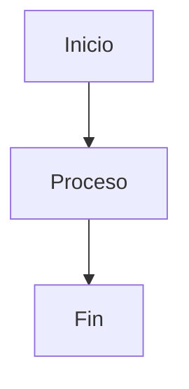
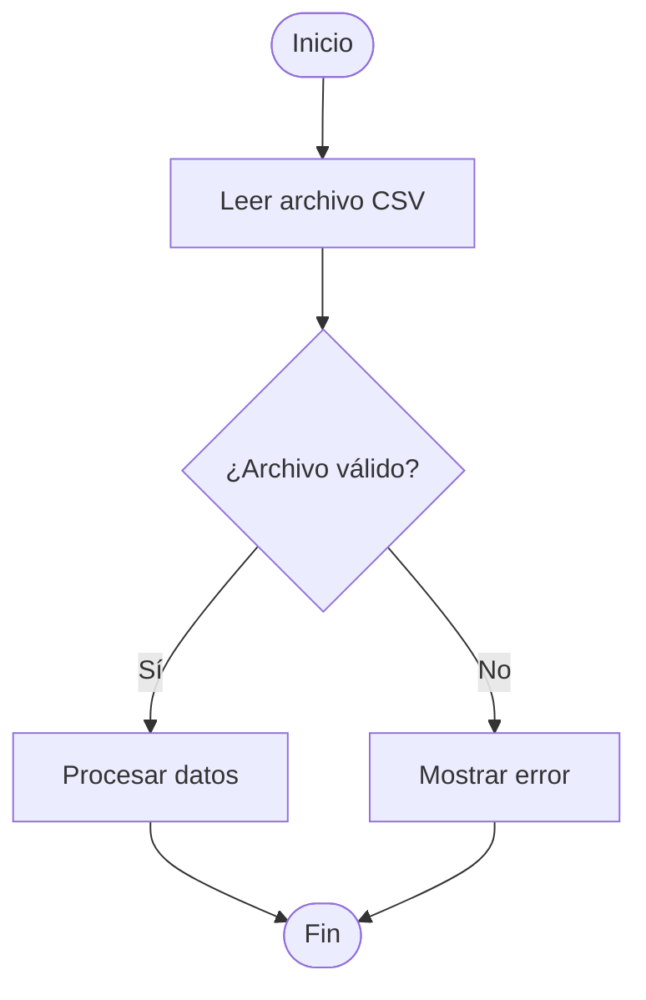
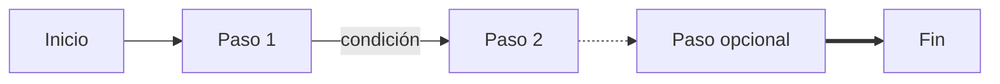
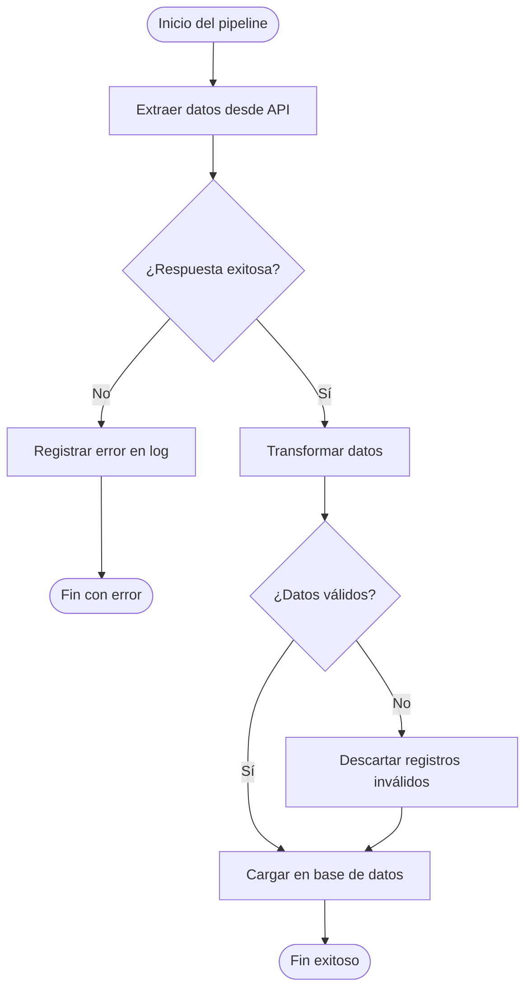
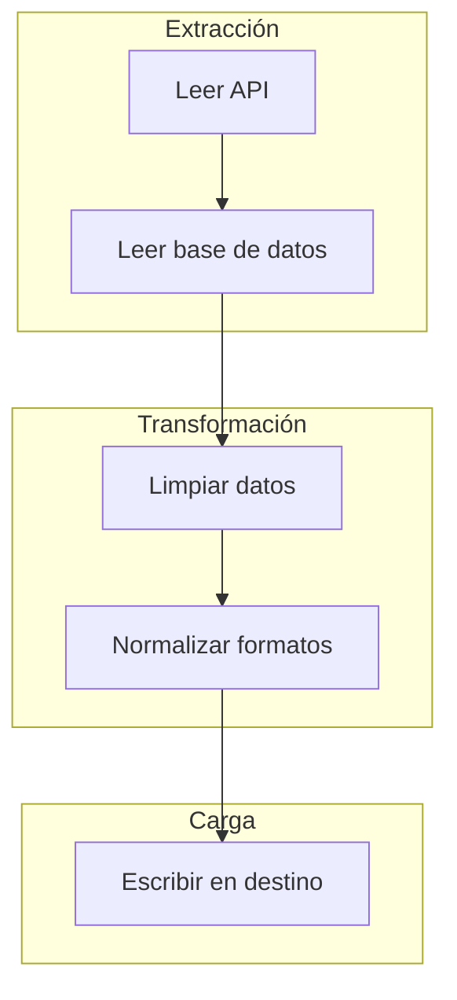
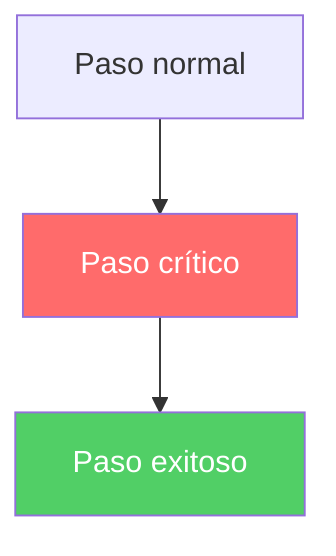

# Clase 01: Introducción a Mermaid y diagramas de flujo

## Objetivos de aprendizaje

- Entender qué es Mermaid y para qué sirve.
- Configurar un entorno para visualizar diagramas Mermaid.
- Crear diagramas de flujo (*flowcharts*) básicos e intermedios.
- Conocer la sintaxis de nodos, conexiones y estilos.

---

## ¿Qué es Mermaid?

Mermaid es una librería de JavaScript que convierte texto con una sintaxis especial en diagramas visuales. El concepto clave es que los diagramas viven dentro de tu código o documentación como texto plano, no como archivos de imagen externos.

### Analogía

Piensa en Mermaid como el Markdown de los diagramas. Así como en Markdown escribes `**negrita**` y obtienes **negrita**, en Mermaid escribes una descripción de un diagrama y obtienes el diagrama renderizado.

La diferencia con herramientas gráficas como PowerPoint o draw.io es que en Mermaid:
- Los diagramas se guardan como texto → fáciles de versionar con git.
- Se actualizan editando el texto → no hay que redibujar nada.
- Viven junto al código o la documentación → siempre accesibles.

---

## ¿Dónde se usa Mermaid?

| Plataforma | Soporte |
|------------|---------|
| GitHub | Nativo en archivos `.md`, issues y pull requests |
| GitLab | Nativo en archivos `.md` y wikis |
| Notion | Bloque de código con tipo "Mermaid" |
| VS Code | Con la extensión *Markdown Preview Mermaid Support* |
| Jupyter Notebooks | Con la librería `mermaid-py` |

---

## ¿Cómo se escribe un bloque Mermaid?

En un archivo Markdown, un diagrama Mermaid se escribe dentro de un bloque de código con el tipo `mermaid`:

````markdown

````

GitHub, GitLab y otras plataformas reconocen ese bloque y muestran el diagrama en lugar del texto.

---

## Diagramas de flujo (*flowcharts*)

Un diagrama de flujo muestra los pasos de un proceso y las decisiones que lo ramifican. Es uno de los tipos de diagrama más útiles para documentar lógica de negocio, algoritmos y flujos de trabajo.

### Sintaxis básica

Todo diagrama de flujo comienza con `graph` seguido de la **dirección** del flujo:

| Código | Significado |
|--------|-------------|
| `graph TD` | Top-Down (de arriba hacia abajo) |
| `graph LR` | Left-Right (de izquierda a derecha) |
| `graph BT` | Bottom-Top (de abajo hacia arriba) |
| `graph RL` | Right-Left (de derecha a izquierda) |

---

### Nodos (*nodes*)

Un nodo es cada elemento del diagrama. La forma del nodo se define con los caracteres que lo rodean:

| Sintaxis | Forma | Uso típico |
|----------|-------|------------|
| `A[Texto]` | Rectángulo | Proceso o paso |
| `A(Texto)` | Rectángulo redondeado | Inicio / Fin |
| `A{Texto}` | Rombo | Decisión |
| `A([Texto])` | Cápsula / Estadio | Inicio / Fin alternativo |
| `A[(Texto)]` | Cilindro | Base de datos |
| `A((Texto))` | Círculo | Evento |



---

### Conexiones (*edges*)

Las flechas conectan los nodos entre sí:

| Sintaxis | Resultado |
|----------|-----------|
| `A --> B` | Flecha sólida |
| `A --- B` | Línea sin flecha |
| `A -- texto --> B` | Flecha con etiqueta |
| `A -.-> B` | Flecha punteada |
| `A ==> B` | Flecha gruesa |



---

## Ejemplo completo: proceso de datos

Imaginemos el flujo de un pipeline (*pipeline*) de datos simple:



Este diagrama describe exactamente qué hace el código, y vive en el mismo archivo Markdown que lo documenta.

---

## Subgrafos (*subgraphs*)

Puedes agrupar nodos relacionados dentro de un subgrafo para organizar mejor diagramas complejos:



---

## Estilos y clases (opcional)

Puedes personalizar el color y estilo de los nodos:



> Para la mayoría de los casos, no necesitas estilos. El diagrama comunica bien sin ellos. Úsalos solo cuando quieras destacar algo puntual.

---

## Errores comunes al empezar

| Error | Causa | Solución |
|-------|-------|----------|
| El diagrama no renderiza | Falta la palabra `graph` o `TD`/`LR` | Revisa la primera línea |
| Error de sintaxis en nodo | Texto con caracteres especiales sin comillas | Pon el texto entre comillas: `A["Texto con: dos puntos"]` |
| Flecha mal escrita | Usar `->` en lugar de `-->` | Mermaid usa `-->` (dos guiones) |
| Nodo sin identificador | Olvidar la letra identificadora | Cada nodo necesita un ID único: `A[Texto]` |

---

## Ejercicios prácticos

1. **Tu primer diagrama**: Crea un archivo `flujo.md` y escribe un diagrama de flujo con al menos 4 nodos que describa tu rutina matutina (levantarse, desayunar, etc.). Incluye al menos una decisión (rombo).

2. **Documenta un algoritmo conocido**: Dibuja el diagrama de flujo de un algoritmo simple que conozcas, por ejemplo: determinar si un número es par o impar, o el algoritmo de búsqueda binaria.

3. **Modela un proceso de trabajo**: Piensa en un proceso de tu trabajo o estudio (entregar una tarea, hacer un pull request, pedir vacaciones) y documentalo como diagrama de flujo.

4. **Usa subgrafos**: Toma el diagrama del ejercicio anterior y agrupa los nodos en al menos 2 subgrafos que tengan sentido conceptualmente.

5. **Compara dirección**: Copia un diagrama que ya hayas creado y cambia `graph TD` por `graph LR`. ¿Cuál se lee mejor? ¿Depende del contenido?

---

[Siguiente clase: Diagramas de secuencia y ER →](../clase-02-diagramas-de-secuencia-y-er/README.md)
