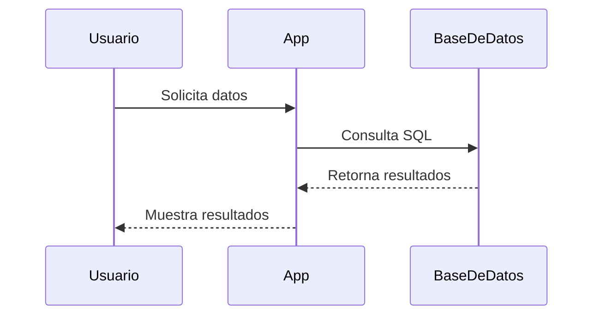
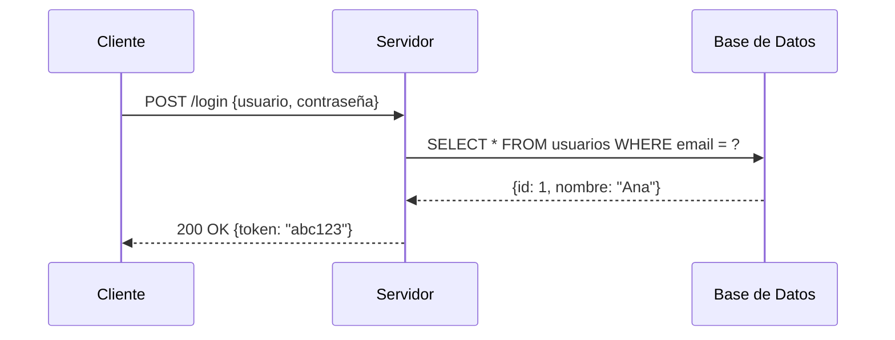
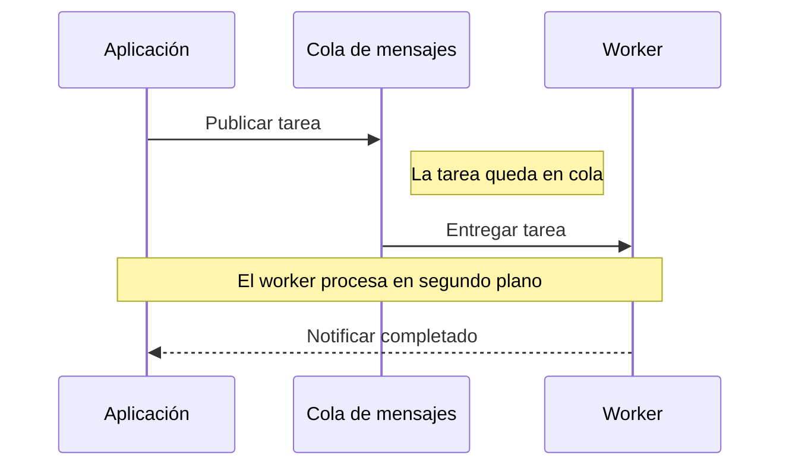
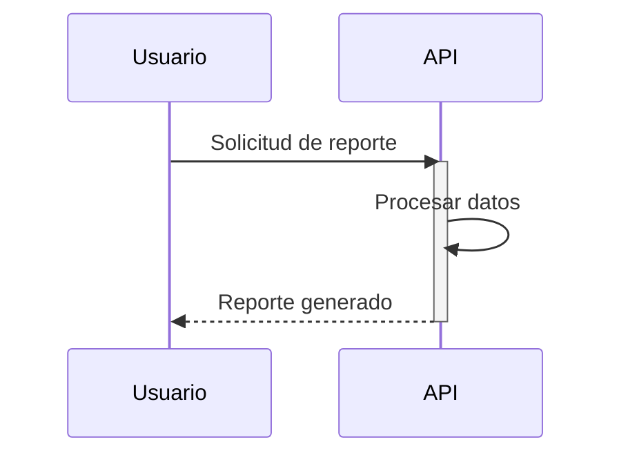
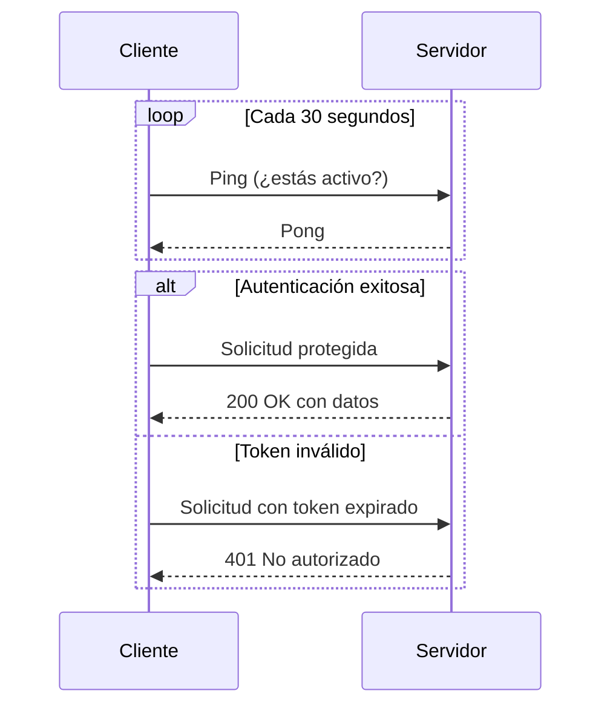
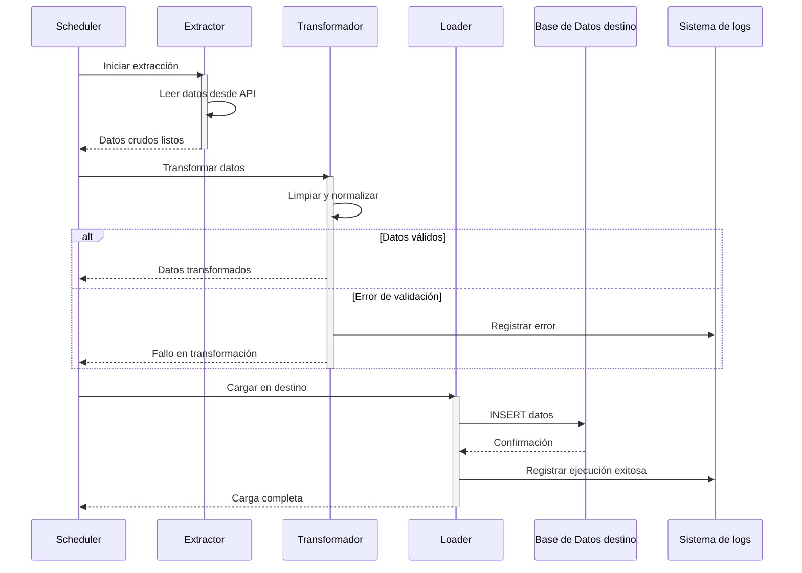
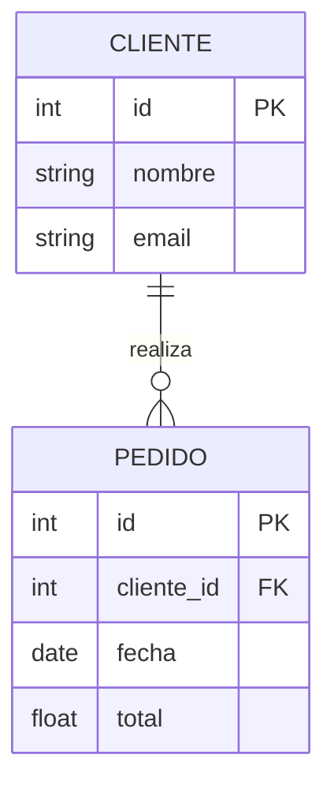
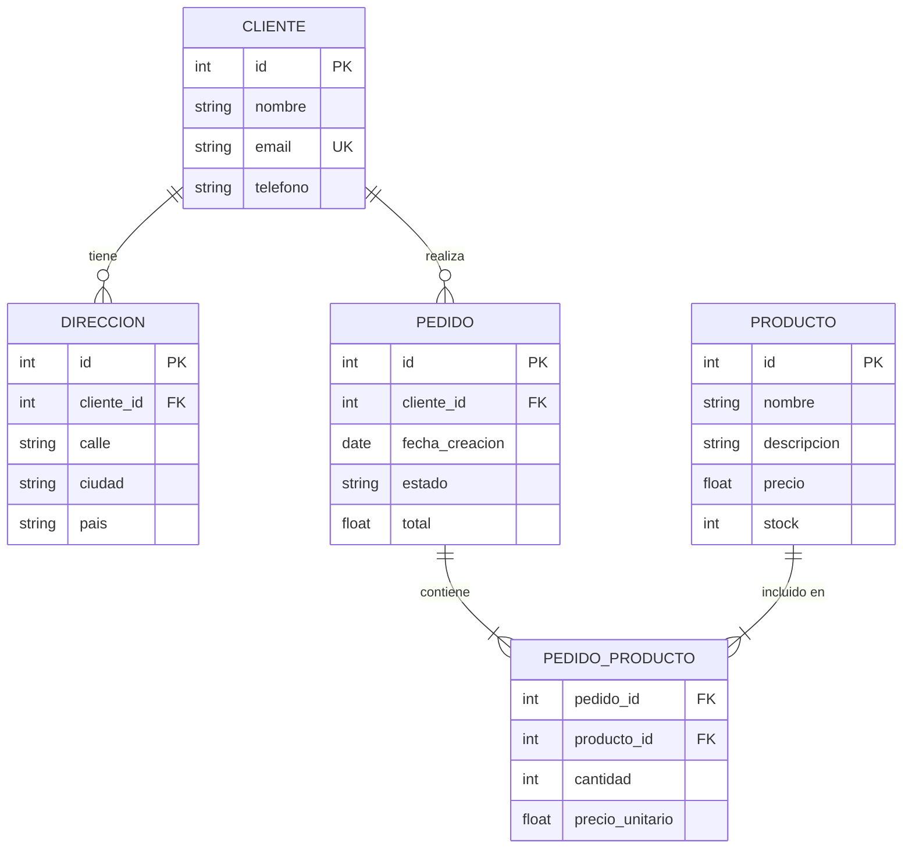

# Clase 02: Diagramas de secuencia y entidad-relación

## Objetivos de aprendizaje

- Entender para qué sirven los diagramas de secuencia y cuándo usarlos.
- Crear diagramas de secuencia que muestren interacciones entre sistemas o componentes.
- Entender qué son los diagramas entidad-relación (*entity-relationship*, ER).
- Modelar una estructura de base de datos sencilla con Mermaid.

---

## Parte 1: Diagramas de secuencia (*sequence diagrams*)

### ¿Qué son?

Un diagrama de secuencia muestra cómo **varios actores o sistemas se comunican entre sí a lo largo del tiempo**. Mientras que el diagrama de flujo muestra los pasos de un proceso, el diagrama de secuencia muestra *quién le habla a quién* y *en qué orden*.

### Analogía

Imagina una conversación telefónica entre tres personas. Un diagrama de secuencia es como la transcripción de esa conversación, pero con líneas verticales para cada persona y flechas horizontales para cada mensaje. Queda muy claro quién dice qué y cuándo.

---

### Sintaxis básica

Un diagrama de secuencia en Mermaid comienza con `sequenceDiagram`:

---

### Tipos de flechas

| Sintaxis | Tipo | Uso típico |
|----------|------|------------|
| `A->>B: mensaje` | Flecha sólida | Llamada / solicitud |
| `A-->>B: mensaje` | Flecha punteada | Respuesta |
| `A->B: mensaje` | Línea sin punta | Comunicación sin respuesta esperada |
| `A-xB: mensaje` | Flecha con X | Mensaje fallido o descartado |

---

### Participantes (*participants*)

Puedes declarar los participantes al inicio para controlar el orden en que aparecen. Si no los declaras, Mermaid los agrega en el orden en que los encuentra.

> El alias (`as`) permite mostrar un nombre más legible en el diagrama aunque el identificador interno sea más corto.

---

### Notas (*notes*)

Puedes agregar notas explicativas sobre un participante o entre dos participantes:

---

### Bloques de activación (*activation*)

Puedes mostrar cuándo un participante está "activo" procesando algo usando `activate` y `deactivate`:

---

### Condiciones y bucles

Mermaid permite mostrar lógica condicional y repeticiones en diagramas de secuencia:

| Bloque | Uso |
|--------|-----|
| `loop Descripción ... end` | Repetición |
| `alt Caso 1 ... else Caso 2 ... end` | Condición alternativa |
| `opt Descripción ... end` | Bloque opcional |

---

### Ejemplo completo: pipeline ETL

Este diagrama modela el flujo de un proceso ETL (*Extract, Transform, Load*):

---

## Parte 2: Diagramas entidad-relación (*entity-relationship diagrams*, ERD)

### ¿Qué son?

Un diagrama ER muestra la **estructura de una base de datos**: qué tablas existen, qué columnas tienen, y cómo se relacionan entre sí. Son fundamentales para diseñar o documentar bases de datos.

### Analogía

Imagina que debes organizar una biblioteca. Un ERD sería el plano de cómo están organizados los libros (tablas), qué información tiene cada libro (columnas), y cómo se conectan los libros con los autores, los géneros y los préstamos (relaciones).

---

### Sintaxis básica

Un diagrama ER en Mermaid comienza con `erDiagram`:

---

### Atributos de columnas

Cada atributo tiene la forma `tipo nombre [clave]`:

| Sufijo | Significado |
|--------|-------------|
| `PK` | Clave primaria (*primary key*) |
| `FK` | Clave foránea (*foreign key*) |
| `UK` | Clave única (*unique key*) |

---

### Tipos de relaciones

La cardinalidad (*cardinality*) define cuántas instancias de una entidad se relacionan con otra:

| Sintaxis | Cardinalidad | Significado |
|----------|-------------|-------------|
| `||--||` | Uno a uno | Un cliente tiene exactamente una dirección |
| `||--o{` | Uno a muchos | Un cliente puede tener muchos pedidos |
| `}o--o{` | Muchos a muchos | Un producto puede estar en muchos pedidos y viceversa |
| `||--o\|` | Uno a cero o uno | Un empleado puede tener o no un apodo |

La etiqueta al final (`"realiza"`) describe la naturaleza de la relación.

---

### Ejemplo completo: sistema de e-commerce

---

## ¿Cuándo usar cada tipo de diagrama?

| Situación | Diagrama recomendado |
|-----------|---------------------|
| Documentar un algoritmo o proceso | Flujo (*flowchart*) |
| Mostrar cómo interactúan dos o más sistemas | Secuencia |
| Diseñar o documentar una base de datos | Entidad-relación (ER) |
| Mostrar herencia o estructura de clases | Clases (no visto en este curso) |
| Mostrar estados de un sistema | Estado (no visto en este curso) |

---

## Ejercicios prácticos

1. **Diagrama de secuencia: inicio de sesión**: Crea un diagrama de secuencia para el proceso de iniciar sesión en una aplicación web. Incluye al menos tres participantes: el usuario, el servidor de la aplicación y una base de datos.

2. **Diagrama de secuencia con error**: Extiende el ejercicio anterior para incluir el caso en que la contraseña es incorrecta. Usa un bloque `alt`/`else` para modelar ambos caminos.

3. **ERD de una biblioteca**: Diseña el diagrama ER de un sistema de biblioteca que gestione libros, autores, usuarios y préstamos. Piensa en qué relaciones existen entre estas entidades.

4. **ERD de tu proyecto**: Si estás trabajando en algún proyecto con datos estructurados, modela su base de datos (o la que usarías) en un ERD. Si no tienes proyecto propio, modela el sistema de notas de un curso universitario.

5. **Combina diagramas en un README**: Crea un archivo `README.md` para un proyecto ficticio que incluya un diagrama de flujo para el proceso general, un diagrama de secuencia para la interacción con una API, y un ERD para la base de datos.

---

[Volver al módulo de Documentación de Código](../../README.md)
